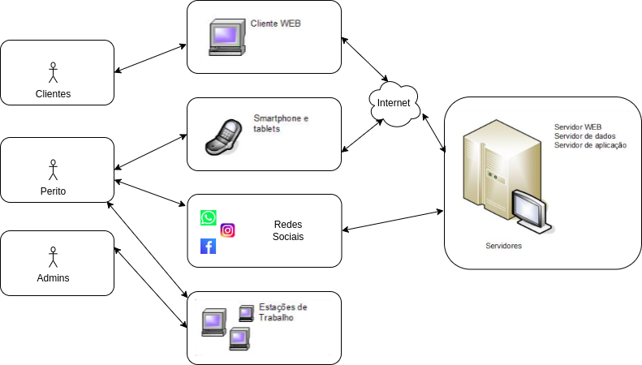

<h1>Visão do Produto</h1>

<h2>PeriMec</h2>

<small>Versão 1.0</small>

---

## Histórico de revisões

|    Data    | Versão |           Descrição           |      Autor       |
| :--------: | :----: | :---------------------------: | :--------------: |
| 02/12/2024 |  1.0   |     Criação do documento      |  Equipe PeriMec  |

---

## Sumário

- [Introdução](#introdução)
  - [Propósito](#propósito)
  - [Definições](#definições)
  - [Escopo do produto](#escopo-do-produto)
- [Posicionamento](#posicionamento)
  - [Oportunidade de negócios](#oportunidade-de-negócios)
  - [Descrição dos benefícios para os clientes e dos problemas resolvidos](#descrição-dos-benefícios-para-os-clientes-e-dos-problemas-resolvidos)
- [Descrição dos stakeholders e dos usuários](#descrição-dos-stakeholders-e-dos-usuários)
  - [Stakeholders](#stakeholders)
  - [Usuários e atores](#usuários-e-atores)
- [Descrição do ambiente de uso](#descrição-do-ambiente-de-uso)
  - [Ambiente de uso](#ambiente-de-uso)
  - [Necessidades principais quanto ao ambiente](#necessidades-principais-quanto-ao-ambiente)
- [Visão geral do produto](#visão-geral-do-produto)
  - [Visão geral](#visão-geral)
  - [Custo e venda](#custo-e-venda)
  - [Licenciamento e instalação](#licenciamento-e-instalação)
  - [Características e funcionalidades de alto nível](#características-e-funcionalidades-de-alto-nível)
  - [Restrições](#restrições)

# Introdução

O PeriMec é um sistema que possibilita o agendamento de perícias mecânicas, gestão de clientes e comércio de carros usados. Este sistema visa centralizar e automatizar processos, melhorando a eficiência operacional e a experiência do cliente.

## Propósito

O propósito do sistema do PeriMec é simplificar e automatizar os processos de agendamento de perícias mecânicas e gestão de vendas de carros usados, proporcionando melhor experiência para os clientes e aumento na transparência e confiabilidade das operações.

### Definições

|    Termo    | Definição                                                                                                                       |
| :---------: | ------------------------------------------------------------------------------------------------------------------------------- |
| PeriMec  | Sistema de Controle de Vendas e Agendamentos |
|   Clientes   |  São as pessoas que financiam o sistema da PeriMec.  |                                               
| Consumidor  | É uma pessoa física que compra um produto ou agenda uma perícia.|                                                               
|       Perito     | É a pessoa que realiza as perícias mecânicas e venda de carros. |                                                          
|     Perícia    | É o principal serviço oferecido pelo perito e agendado pelo consumidor.| 

## Escopo do produto

O PeriMec é um sistema que tem como objetivo tornar eficiente a comunicação entre consumidor e perito. O sistema oferece serviços de inspeção técnica para avaliar a condição dos veículos, seja para fins de compra e venda, seguros ou manutenção preventiva. Disponibiliza um portfólio de veículos usados, com laudos técnicos que garantem a confiabilidade das informações e facilita a compra e venda através de plataformas integradas e atendimento personalizado.
# Posicionamento

## Oportunidade de negócios

O **Sistema de Controle de Vendas e Agendamentos (Perimec)** apresenta várias oportunidades de negócios no setor automotivo e no setor de serviços relacionados à inspeção e venda de veículos reparados. Abaixo estão algumas das principais oportunidades que o sistema pode trazer:

1. Acesso facilitado ao mercado de veículos reparados

Para consumidores: o sistema pode se posicionar como um canal confiável para a compra de veículos reparados, promovendo a transparência e segurança no processo de aquisição.
Para vendedores: A oficina pode listar veículos no catálogo, ampliando sua base de clientes, além de facilitar a organização de vendas e agendamentos de veículos por meio de um banco de dados que pode ser acessado pela palma da mão.

2. Segmentação de mercado

Com perfis personalizados de consumidores, o sistema pode atrair nichos específicos, como aqueles focados na compra de veículos reparados, oferecendo uma experiência adaptada às suas necessidades.

3. Garantia como diferencial competitivo

Oferecer garantia nos veículos listados no catálogo pode ser um atrativo poderoso, especialmente em um mercado onde há desconfiança em relação a carros reparados.

4. Facilidade na gestão de inspeções e agendamentos

Automatizar a logística de agendamentos de perícias entre consumidores e peritos cria uma experiência simplificada e eficiente. Esse diferencial pode atrair usuários que valorizam praticidade.

5. Confiança e fidelização de clientes

Construir uma base de consumidores fieis ao oferecer um sistema confiável que centraliza informações relevantes sobre veículos reparados e oferece suporte pós-venda.

O sistema de Controle de Vendas e Agendamentos para Perimec combina gestão eficiente com a confiança necessária para aumentar a atratividade de veículos reparados. Sua implementação pode gerar benefícios diretos para consumidores e profissionais da empresa criando novas oportunidades de receita e colaboração.

## Descrição dos benefícios para os clientes e dos problemas resolvidos

| **Benefício**                                  | **Problema Resolvido**                                                                                     | **Quem é afetado**                   |
|-----------------------------------------------|------------------------------------------------------------------------------------------------------------|---------------------------------------|
| Maior Transparência e Confiança               | Falta de informações confiáveis sobre veículos reparados                                                   | Consumidores                          |
| Praticidade e Eficiência                      | Processos manuais demorados para agendamentos, consultas e organização de vendas                           | Consumidores e vendedores             |
| Experiência Personalizada                     | Falta de direcionamento na oferta de veículos e serviços                                                   | Consumidores                          |
| Economia e Garantias                          | Insegurança sobre a qualidade dos veículos e ausência de garantias                                         | Consumidores                          |
| Facilidade no Processo de Inspeção            | Logística complexa e comunicação ineficiente entre consumidores e peritos                                  | Consumidores e peritos                |
| Suporte Pós-Venda                             | Falta de acompanhamento pós-venda e dificuldade em acessar informações após a compra                       | Consumidores                          |
| Confiança no Mercado                          | Desorganização e falta de credibilidade no mercado de veículos reparados                                   | Consumidores e vendedores             |

---

# Descrição dos stakeholders e dos usuários

Esta seção descreve os stakeholders e os usuários do **Sistema de Controle de Vendas e Agendamentos (Perimec).**

## Stakeholders

Segue abaixo a lista de stakeholders.

| **Stakeholders** | **Descrição** | **Papel** | 
|------------------|-------------------------------------------------------------------------------------------------------------|------------------|
| Clientes | Pessoas que solicitaram o desenvolvimento do sistema e o utilizarão para gerenciar funcionários, produtos e serviços | Usuário do sistema |
| Perito | Profissionais responsáveis por realizar serviços com garantia e venda de produtos e utilizam o sistema para gerenciar esses processos | Usuário do sistema |
|Equipe de Desenvolvimento |Profissionais responsáveis por desenvolver o sistema|Desenvolvedores|
|Product Owner |Profissional responsável por traduzir as ideias e interesses dos usuários para a Equipe de Desenvolvimento | Liderar o desenvolvimento do Produto|
|Departamento de Marketing e Mídias Digitais | Profissionais responsáveis por fornecer informações sobre os produtos e serviços e captar novos clientes |Fornecer informações e captar clientes|

## Usuários e atores

Segue tabela com os usuários e atores do sistema:

| **Usuário** | **Descrição** | **Responsabilidades** | **Stakeholders** |
| ------------------------ | ------------------------------------------------------------------------------------------------------------ | -------------------------------------------------------------------------------------------------------------------------------------------------------------------------------------------------------------------------------- | ----------------------------------------------------------------------------------------------- |
| Clientes | Pessoas que solicitaram o desenvolvimento do sistema e o utilizarão para gerenciar funcionários, produtos e serviços | Gerenciar os peritos, produtos, serviços e agendamentos realizados no sistema. Acompanhar o prazo de realização dos serviços, o fluxo operacional e receber notificações sobre o resultado.| Equipe de Desenvolvimento, Product Owner |
| Consumidores | Pessoas que compram produtos e serviços com garantia e utilizam o sistema para gerenciar esses processos  | Registrar os produtos e serviços adquiridos, e agendamentos realizados no sistema. Acompanhar o prazo de realização dos serviços e receber notificações sobre o resultado.| Equipe de Desenvolvimento, Peritos e Cliente |
| Perito | Profissional responsável por atender, prover serviços e fornecer suporte aos clientes | Atender às solicitações dos clientes relacionadas aos produtos e serviços registrados no sistema, fornecer suporte aos clientes e gerenciar os atendimentos agendados. | Clientes, Equipe de Desenvolvimento, Product Owner. |
| Administrador do Sistema | Profissional responsável por gerenciar e manter o sistema. | Gerenciar os usuários do sistema, realizar backup dos dados, atualizar o sistema e garantir o seu funcionamento adequado. | Equipe de Desenvolvimento, Product Owner e Cliente. |

# Descrição do ambiente de uso

## Ambiente de uso

A seguir, são descritos alguns ambientes em que o sistema pode ser utilizado:

1. **Ambiente do Usuário**: Neste ambiente, os usuários acessam o sistema para agendar perícias ou realizar transações relacionadas ao comércio de veículos.Os usuários podem acessar o sistema através de dispositivos móveis, como smartphones e tablets, ou através de um navegador web em seus computadores. O navegador web poderá ser o Google Chrome, Mozilla Firefox ou Microsoft Edge com acesso através do endereço web <https://www.perimec.com.br>. O sistema web será projetado responsivamente, de forma a possibilitar o acesso multiplataforma. O ambiente do cliente é acessado através da internet e requer um login e senha de acesso para agendamento de perícias e compra de produtos.
2. **Ambiente Administrativo**: Neste ambiente, o sistema é utilizado pelos administradores do sistema para gerenciar e manter o sistema. Os administradores podem acessar o sistema através de um navegador web em um computador, e possuem acesso a recursos de gerenciamento, como gerenciamento de usuários, serviços, agendamentos, backup dos dados, e atualização do sistema.
3. **Ambiente de Teste**: Neste ambiente, o sistema é utilizado para testar novas funcionalidades e correções de bugs antes de serem disponibilizadas para os usuários finais. O ambiente de teste é acessado apenas através de um navegador web em um computador, e requer um login e senha de acesso específicos, além de uma base de dados específica (não afetando o ambiente de produção) para o ambiente de teste.

## Necessidades principais quanto ao ambiente

A seguir, é apresentada uma tabela que descreve as necessidades dos clientes com relação à qualidade, desempenho, segurança, usabilidade e confidencialidade do sistema Perimec, juntamente com sua prioridade, interesse, solução atual e soluções propostas:
| Necessidade                                                                                                                                              | Prioridade | Interesse                                                                                                                                                | Solução Atual                                                                                                                 | Soluções Propostas                                                                                                                                                                                                                                                       |
| -------------------------------------------------------------------------------------------------------------------------------------------------------- | ---------- | -------------------------------------------------------------------------------------------------------------------------------------------------------- | ----------------------------------------------------------------------------------------------------------------------------- | ------------------------------------------------------------------------------------------------------------------------------------------------------------------------------------------------------------------------------------------------------------------------ |
| **Qualidade:** O sistema deverá apresentar um alto nível de confiabilidade, operando de forma estável e livre de falhas.                                                  | Alta       | Os clientes esperam que o sistema funcione corretamente e não apresente problemas que possam prejudicar o controle de suas garantias.                    | Testes manuais realizados pela equipe de desenvolvimento.                                                                     | Implementar testes automatizados e processos de garantia de qualidade para identificar e corrigir erros e bugs.                                                                                                                                                          |
| **Desempenho:** O sistema deve ter um bom desempenho, com tempo de resposta rápido e sem atrasos significativos.                                         | Alta       | Os clientes esperam que o sistema responda rapidamente às suas solicitações e não apresente atrasos.                                                     | Servidor dedicado para hospedagem do sistema e monitoramento constante do desempenho.                                         | Melhorar a arquitetura do sistema para garantir melhor desempenho e escalabilidade, bem como otimizar consultas de banco de dados e uso de recursos do sistema.                                                                                                          |
| **Escalabilidade:** O sistema deve ter capacidade para suportar o crescimento do número de clientes e garantias.                                         | Alta       | Os clientes esperam que o sistema continue funcionando de forma confiável e sem atrasos, mesmo com um grande número de usuários e garantias registradas. | Arquitetura escalável, com distribuição de carga e uso de servidores em nuvem.                                                | Implementar arquitetura em nuvem e balanceamento de carga para garantir a escalabilidade do sistema.                                                                                                                                                                     |
| **Segurança:** O sistema deve ser seguro, protegido contra acesso não autorizado, invasões e roubo de dados.                                             | Alta       | Os clientes esperam que suas informações estejam seguras e protegidas contra invasões e acesso não autorizado.                                           | Autenticação de usuários com login e senha, criptografia de dados sensíveis e acesso restrito somente a usuários autorizados. | Implementar medidas adicionais de segurança, como autenticação de dois fatores, certificados SSL e criptografia avançada.                                                                                                                                                |
| **Usabilidade:** O sistema deve ser fácil de usar e entender, com uma interface intuitiva e amigável ao usuário.                                         | Moderada   | Os clientes esperam que o sistema seja fácil de usar e entender, sem a necessidade de treinamento especializado.                                         | Interface de usuário simples e intuitiva.                                                                                     | Realizar testes de usabilidade com usuários reais para identificar áreas de melhoria e implementar melhorias na interface do usuário.                                                                                                                                    |
| **Tempo de resposta:** O sistema deve ter um tempo de resposta rápido para que os clientes possam acessar e controlar suas garantias de forma eficiente. | Moderada   | Os clientes esperam que o sistema responda às suas solicitações rapidamente para que possam gerenciar suas garantias de forma mais eficiente.            | Monitoramento constante do tempo de resposta do sistema.                                                                      | Realizar otimizações de performance, como o uso de cache, e garantir que o sistema esteja sempre atualizado para obter um tempo de resposta rápido.                                                                                                                      |
| **Confidencialidade:** O sistema deve proteger a privacidade e confidencialidade das informações dos clientes.                                           | Alta       | Os clientes esperam que suas informações sejam mantidas em sigilo e protegidas contra acesso não autorizado.                                             | Controles de acesso restrito, criptografia de dados sensíveis e monitoramento constante das atividades do usuário.            | Realizar auditorias de segurança e implementar medidas adicionais de privacidade e proteção de dados, como política de privacidade clara e concisa, consentimento explícito do usuário para coleta e uso de dados, e implementação de protocolos de segurança avançados. |

---
# Visão Geral do Produto

# Visão Geral

O **PeriMec 1.0** é um sistema integrado para o setor automotivo, oferecendo soluções para **agendamento de perícias mecânicas**, **gestão de clientes** e **comércio de veículos usados**. Ele centraliza operações em uma única plataforma, promovendo maior eficiência, transparência e confiabilidade para consumidores e profissionais.

Com acesso multiplataforma (dispositivos móveis e navegadores web), o PeriMec facilita o gerenciamento de processos de inspeção e vendas, proporcionando:
- Agilidade no agendamento de perícias.
- Maior transparência no mercado de veículos reparados.
- Ferramentas de organização e controle para peritos e administradores.

Uma estrutura operacional do produto é apresentada na Figura 1.

---

# Custo e Venda

## Custo do Sistema
O desenvolvimento e a operação do PeriMec envolvem:
- **Desenvolvimento inicial**: R$ 150.000
- **Infraestrutura e suporte anual**: R$ 30.000
- **Marketing inicial**: R$ 20.000

## Modelo de Venda
O PeriMec adota um modelo de assinatura, com os seguintes planos:

1. **Plano Básico** (Gratuito ou baixo custo):
   - Funcionalidades essenciais, como agendamento e consulta ao catálogo.
   - Publicidade inclusa.

2. **Plano Profissional** (R$ 49,90/mês por usuário ativo):
   - Recursos avançados, como relatórios detalhados e gerenciamento completo de vendas.
   - Suporte técnico prioritário.

3. **Plano Empresarial** (R$ 499,90/mês por grupo de usuários):
   - Funcionalidades personalizadas para empresas com múltiplas unidades.
   - Relatórios analíticos e ferramentas administrativas avançadas.

---

# Licenciamento e Instalação

## Licenciamento
O PeriMec será disponibilizado como **SaaS (Software as a Service)**, garantindo acesso via internet com assinatura. Detalhes:
- **Licença por assinatura**: Planos mensais ou anuais.
- **Período experimental**: Até 30 dias gratuitos.
- **Contrato de uso**: Inclui conformidade com a LGPD e termos de uso.

## Instalação
O PeriMec é um sistema web que não requer instalação local. Os requisitos incluem:
1. **Dispositivos compatíveis**:
   - Navegadores modernos (Chrome, Firefox, Edge) em computadores Windows, macOS ou Linux.
   - Smartphones ou tablets com Android ou iOS.
2. **Acesso à internet**.
3. **Cadastro inicial** via site ou aplicativo.

## Para Empresas
- **Treinamento inicial**: Capacitação de equipes para o uso eficiente do sistema.
- **Personalização**: Ajustes conforme necessidades específicas.
- **Suporte técnico dedicado**: Atendimento prioritário com SLA definido.

---

O PeriMec é uma solução prática e confiável que atende às necessidades do mercado automotivo, promovendo eficiência e confiança no setor de veículos reparados.

## Características e funcionalidades de alto nível

Esta seção define e descreve as características do Perimec. Trata-se dos
requisitos de alto nível do sistema que são necessários para propiciar benefícios aos usuários.

1. O sistema deve permitir o cadastro de peritos, consumidores e demais produtos.
2. O sistema deve permitir o agendamento de perícias por parte de um consumidor
3. O sistema deve permitir ao usuário perito que visualize todas as perícias agendadas com o mesmo, sendo possível filtrá-las por ordem de marcação.
4. O sistema deve permitir que o consumidor cadastre um automóvel para vender. Esse cadastro só pode ser concluído após haver contato com um vendedor.
5. O sistema deve ter uma interface de usuário amigável e de fácil utilização, para que os clientes possam utilizar as funcionalidades sem dificuldade.
6. O sistema deve ter um desempenho satisfatório, com tempos de resposta rápidos e sem interrupções ou falhas.
7. O sistema deve ser documentado e ter seu código-fonte disponível para auditoria e manutenção futura.

## Restrições

Algumas possíveis restrições que podem ser aplicadas ao sistema são:

1. **Restrições de software:** O sistema pode ter dependências específicas relacionadas a ferramentas de desenvolvimento, bibliotecas e bancos de dados. Essas limitações afetam o processo de desenvolvimento e a integração com outros sistemas.

2. **Restrições de hardware:** O sistema não tem exigências específicas em relação ao hardware, visto que será executado na web.

3. **Restrições de segurança:** O sistema precisa atender a requisitos de segurança, incluindo autenticação, autorização, criptografia, auditoria, backup e recuperação de desastres. Essas restrições podem afetar tanto o desenvolvimento quanto a operação do sistema.

4. **Restrições de privacidade:** O sistema deve atender aos requisitos de segurança, privacidade e proteção de dados do usuário, conforme a Lei Geral de Proteção de Dados (LGPD).

5. **Restrições de usabilidade:** O sistema deve ser intuitivo, fácil de usar e acessível para usuários com deficiências visuais e motoras.

6. **Restrição de orçamento:** O projeto deve ser concluído dentro de um determinado orçamento e não pode excedê-lo.

7. **Restrições de desempenho**: O sistema deve atender aos requisitos de desempenho, como velocidade, escalabilidade e disponibilidade.

